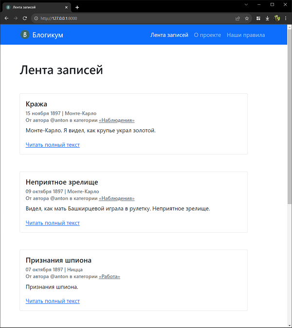
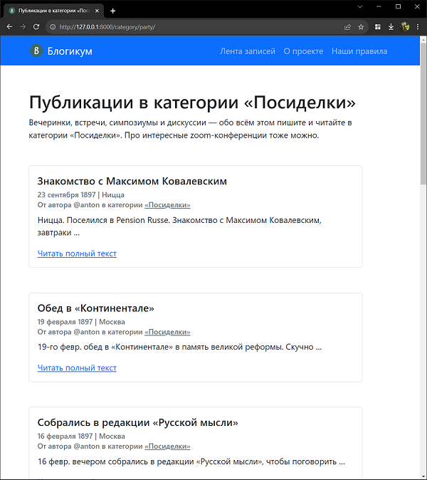
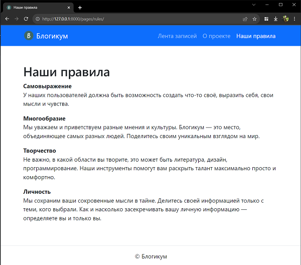
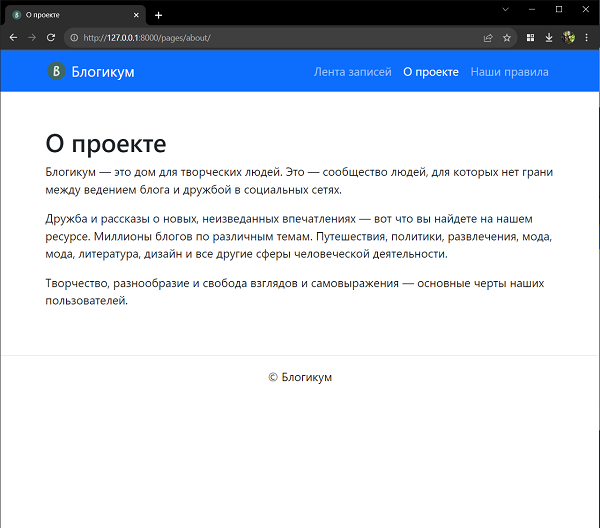
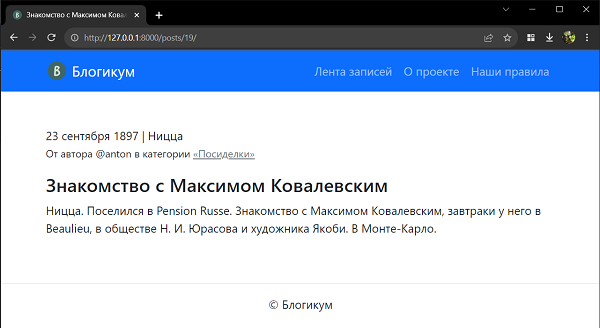

# Blogicum

## Подготовка к запуску

1. Устанавливаем зависимости из [requirements.txt](requirements.txt).
2. Выполняем миграции и заполняем базу данных:
    ```bash
     python manage.py migrate
     python manage.py loaddata ..\db.json
    ```

## О проекте

Исходный файлик-наполнитель для БД - [db.json](db.json) от яндекса - уже содержит суперпользователя, но пароль для него
неизвестен, так что здесь эта запись переопределена следующим образом:

* Логин: admin
* Пароль: 12345678

В этой ветке есть некоторые изменения шаблонов яндекса, если нужен вариант максимально приближенный к исходникам яндекса смотри [ветку](https://github.com/Arkebuzz/django_sprints/tree/original).
<hr>

 

 


